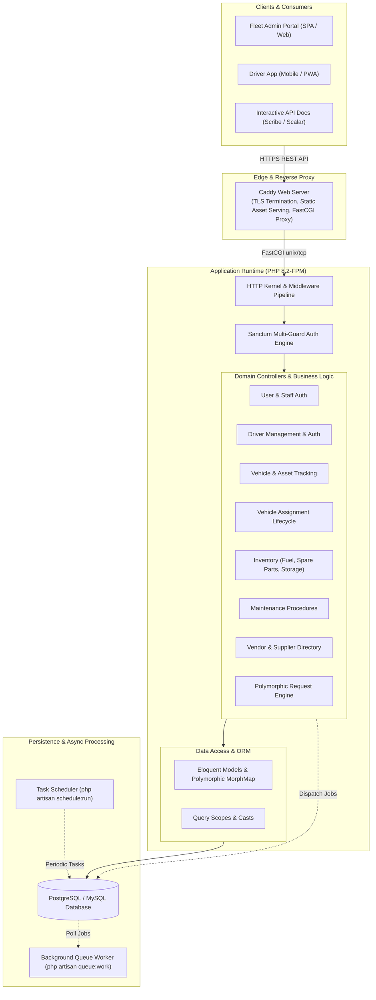
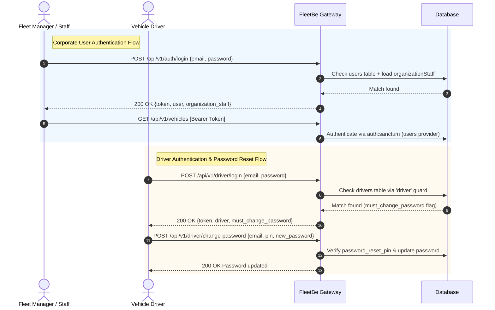
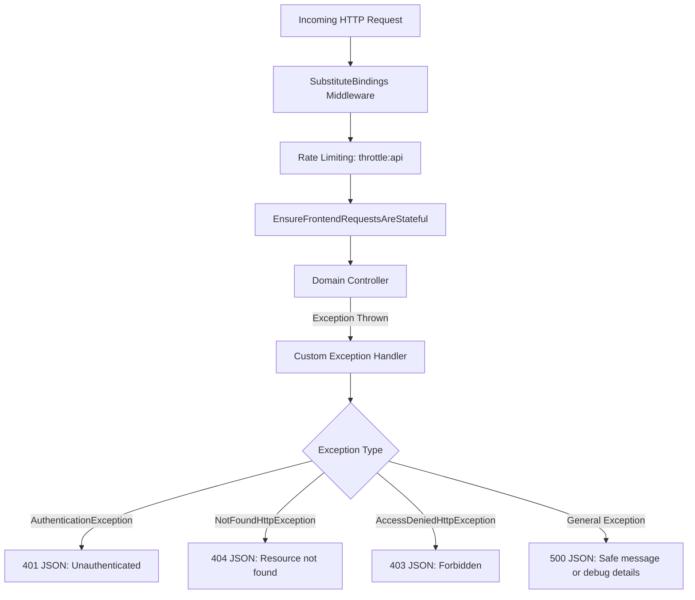

# FleetBe Architecture Documentation

This document describes the high-level architecture, component design, authentication models, request lifecycle, and infrastructure strategy of the **FleetBe** (Fleet Management Backend) application.

---

## 1. System Overview

FleetBe is a multi-tenant Fleet and Asset Management REST API built on **Laravel 12** and **PHP 8.2+**. The platform serves as the central backend for corporate fleet tracking, driver lifecycle management, resource inventory (fuels and spare parts), scheduled maintenance, and resource request/approval workflows.

### 1.1 Architecture Topology



---

## 2. Core Architectural Pillars

### 2.1 Multi-Tenancy Structure

The application adopts a shared-database multi-tenant design centered on the `organizations` table:

```
[organizations]
   ├── [organization_staffs] ──> [users]
   ├── [drivers]
   ├── [vehicles]
   ├── [fuels]
   ├── [spare_parts]
   └── [maintenances]
```

1. **Organization (`organizations`):** The root tenant entity. Every vehicle, driver, fuel reserve, spare part, and maintenance procedure belongs directly to an organization.
2. **Staff Identity (`users` & `organization_staffs`):** User accounts authenticate via the `users` table. The `organization_staffs` pivot assigns the user to an organization with a specific `staff_position`, `staff_status`, and `staff_level`.
3. **Vehicle Assignment:** Vehicles link directly to `organizations` and can be assigned to either an active `driver_id` or an `organization_staff` member (`user_assigned_id`).

---

### 2.2 Dual-Guard Authentication Architecture

FleetBe implements dual-identity authentication utilizing **Laravel Sanctum** tokens across two separate Eloquent providers:



#### Authentication Guards Configuration ([`config/auth.php`](file:///Users/saifyusuph/Documents/ES2%20LTD/fleetbe/config/auth.php)):
* **`web` Guard:** Uses `users` provider (`App\Models\User`). Issues tokens named `auth_token`.
* **`driver` Guard:** Uses `drivers` provider (`App\Models\Drivers`). Issues tokens named `driver_token`. Both drivers and users use Sanctum's `HasApiTokens`.

---

### 2.3 Polymorphic Design Patterns

FleetBe uses Laravel Eloquent polymorphic relationships in two critical areas to keep the database extensible:

#### 1. Polymorphic Storage (`storages` Table)
Physical quantities of different inventory categories are tracked through a generic `storable` relation:
* `storable_type`: Fully-qualified model class or morph alias (`App\Models\Fuel` or `App\Models\SparePart`).
* `storable_id`: Foreign primary key of the resource.
* `total_quantity`: Decimal amount stored in this location/depot.

#### 2. Polymorphic Requests (`requests` Table)
The core request approval pipeline routes fuel replenishment, spare part requests, and maintenance work orders through a unified table. The mapping is registered in [`AppServiceProvider::boot`](file:///Users/saifyusuph/Documents/ES2%20LTD/fleetbe/app/Providers/AppServiceProvider.php):

```php
Relation::morphMap([
    'fuel'        => \App\Models\Fuel::class,
    'spare_part'  => \App\Models\SparePart::class,
    'maintenance' => \App\Models\Maintenance::class,
]);
```

Each record contains:
* `requestable_type`: `'fuel'`, `'spare_part'`, or `'maintenance'`
* `requestable_id`: ID of the requested resource
* `with_sparepart`, `spare_part_id`, `other_sparepart`: Conditional attachment of physical spare parts to maintenance tasks.
* `previous_id` / `current_request`: Self-referencing history chain to preserve re-requests and audit trails.

---

## 3. Infrastructure & Deployment Architecture

### 3.1 Docker Runtime Stack

The production container combines **Caddy** and **PHP 8.2-FPM** in a multi-stage Docker build:

```
[Incoming Request :8080]
           │
           ▼
     [Caddy Server]
     ├── Static file exists? ──> Serve directly (public/build, public/docs, etc.)
     └── PHP request? ─────────> Reverse proxy via FastCGI to 127.0.0.1:9000 (PHP-FPM)
                                        │
                                        ▼
                                [public/index.php]
```

* **Caddyfile:** Listens on environment variable `{$PORT:8080}`, enables `encode zstd gzip`, sets static cache headers, and directs dynamic requests to PHP-FPM.
* **Supervisord-free Startup:** [`docker/start-server.sh`](file:///Users/saifyusuph/Documents/ES2%20LTD/fleetbe/docker/start-server.sh) spawns `php-fpm` in the background, executes `php artisan migrate --force`, and runs Caddy in the foreground as the primary process.

### 3.2 Background Queue & Cron Workers (Railway Support)

For production deployment on platforms like Railway, dedicated service scripts are provided:
* **HTTP Service:** Runs default Dockerfile container with Caddy + PHP-FPM.
* **Worker Service ([`railway/run-worker.sh`](file:///Users/saifyusuph/Documents/ES2%20LTD/fleetbe/railway/run-worker.sh)):** Executes `php artisan queue:work --tries=3 --timeout=90`.
* **Cron Service ([`railway/run-cron.sh`](file:///Users/saifyusuph/Documents/ES2%20LTD/fleetbe/railway/run-cron.sh)):** Runs an infinite loop invoking `php artisan schedule:run` every 60 seconds.

---

## 4. Request Lifecycle & Global Exception Handling

Every API request flows through [`bootstrap/app.php`](file:///Users/saifyusuph/Documents/ES2%20LTD/fleetbe/bootstrap/app.php) which defines standardized JSON error formatting:



All responses conform to consistent JSON payloads with explicit HTTP status codes (`200`, `201`, `401`, `403`, `404`, `409`, `422`, `500`).
