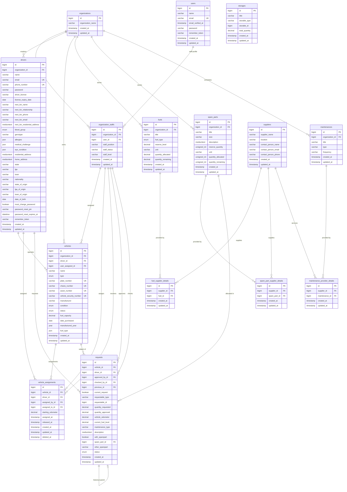

# FleetBe Database Schema Specification

This document provides complete documentation of the database schema for the FleetBe system, including entity relationships, table column definitions, foreign key constraints, indexes, and migration evolution notes.

---

## 1. Entity-Relationship Diagram (ERD)

---

## 2. Table Schemas in Detail

### 2.1 Core Multi-Tenancy & User Management

#### `organizations`
| Column | Type | Nullable | Default | Constraints & Indexes | Description |
|---|---|---|---|---|---|
| `id` | `bigint unsigned` | NO | Auto Increment | Primary Key | Organization identifier |
| `organization_name` | `varchar(255)` | NO | None | None | Legal / trade name of company |
| `created_at` | `timestamp` | YES | NULL | None | Creation timestamp |
| `updated_at` | `timestamp` | YES | NULL | None | Last update timestamp |

#### `users`
| Column | Type | Nullable | Default | Constraints & Indexes | Description |
|---|---|---|---|---|---|
| `id` | `bigint unsigned` | NO | Auto Increment | Primary Key | User identifier |
| `name` | `varchar(255)` | NO | None | None | Full name of user |
| `email` | `varchar(255)` | NO | None | Unique Index | Corporate email address |
| `email_verified_at`| `timestamp` | YES | NULL | None | Verification timestamp |
| `password` | `varchar(255)` | NO | None | None | Bcrypt hashed password |
| `remember_token` | `varchar(100)` | YES | NULL | None | Laravel remember token |
| `created_at` | `timestamp` | YES | NULL | None | Record creation timestamp |
| `updated_at` | `timestamp` | YES | NULL | None | Record update timestamp |

#### `organization_staffs`
| Column | Type | Nullable | Default | Constraints & Indexes | Description |
|---|---|---|---|---|---|
| `id` | `bigint unsigned` | NO | Auto Increment | Primary Key | Staff record identifier |
| `organization_id` | `bigint unsigned` | NO | None | Foreign Key -> `organizations(id)` | Associated organization |
| `user_id` | `bigint unsigned` | NO | None | Foreign Key -> `users(id)` | Associated user account |
| `staff_position` | `varchar(255)` | NO | None | None | Job title / position |
| `staff_status` | `varchar(255)` | NO | None | None | Status (Active, Suspended) |
| `staff_level` | `varchar(255)` | NO | None | None | Hierarchy level |
| `created_at` | `timestamp` | YES | NULL | None | Creation timestamp |
| `updated_at` | `timestamp` | YES | NULL | None | Update timestamp |

---

### 2.2 Drivers

#### `drivers`
| Column | Type | Nullable | Default | Constraints & Indexes | Description |
|---|---|---|---|---|---|
| `id` | `bigint unsigned` | NO | Auto Increment | Primary Key | Driver ID |
| `organization_id` | `bigint unsigned` | NO | None | Foreign Key -> `organizations(id)` ON DELETE CASCADE | Tenant organization |
| `name` | `varchar(255)` | NO | None | None | Driver's full name |
| `email` | `varchar(255)` | NO | None | Unique Index | Unique login email |
| `phone_number` | `varchar(255)` | NO | None | Unique Index | Primary contact phone |
| `password` | `varchar(255)` | NO | None | None | Hashed driver password |
| `driver_license` | `varchar(255)` | NO | None | None | Official license number |
| `license_expiry_date`| `date` | NO | None | None | License expiration date |
| `date_of_birth` | `date` | YES | NULL | None | Driver birthdate |
| `next_kin_name` | `varchar(255)` | NO | None | None | Next of kin full name |
| `next_kin_relationship`| `varchar(255)` | NO | None | None | Next of kin relationship |
| `next_kin_phone` | `varchar(255)` | NO | None | None | Next of kin contact number |
| `next_kin_email` | `varchar(255)` | YES | NULL | None | Next of kin email |
| `next_kin_residential_address` | `mediumtext` | NO | None | None | Next of kin address |
| `blood_group` | `enum` | YES | NULL | Values: A+, A-, B+, B-, AB+, AB-, O+, O- | Medical blood group |
| `genotype` | `varchar(255)` | YES | NULL | None | Medical genotype (AA, AS, SS) |
| `allergies` | `json` | YES | NULL | None | Array of documented allergies |
| `medical_challenge` | `json` | YES | NULL | None | Array of medical conditions |
| `eye_condition` | `json` | YES | NULL | None | Array of eye conditions |
| `residential_address` | `mediumtext`| YES | NULL | None | Current residential address |
| `home_address` | `mediumtext` | YES | NULL | None | Permanent home address |
| `state` | `varchar(255)` | YES | NULL | None | Current state of residence |
| `lga` | `varchar(255)` | YES | NULL | None | Current local government area |
| `town` | `varchar(255)` | YES | NULL | None | Current residential town |
| `nationality` | `varchar(255)` | YES | NULL | None | Nationality (e.g. Nigerian) |
| `state_of_origin` | `varchar(255)` | YES | NULL | None | State of origin |
| `lga_of_origin` | `varchar(255)` | YES | NULL | None | LGA of origin |
| `town_of_origin` | `varchar(255)` | YES | NULL | None | Town of origin |
| `must_change_password`| `boolean` | NO | `true` | None | Forces password change flag |
| `password_reset_pin` | `varchar(255)` | YES | NULL | None | 6-digit PIN for reset/setup |
| `password_reset_expires_at`| `datetime`| YES | NULL | None | PIN expiration timestamp |
| `remember_token` | `varchar(100)` | YES | NULL | None | Sanctum remember token |
| `created_at` | `timestamp` | YES | NULL | None | Creation timestamp |
| `updated_at` | `timestamp` | YES | NULL | None | Update timestamp |

---

### 2.3 Vehicles & Assignments

#### `vehicles`
| Column | Type | Nullable | Default | Constraints & Indexes | Description |
|---|---|---|---|---|---|
| `id` | `bigint unsigned` | NO | Auto Increment | Primary Key | Vehicle identifier |
| `organization_id` | `bigint unsigned` | NO | None | Foreign Key -> `organizations(id)` ON DELETE CASCADE | Owner organization |
| `name` | `varchar(255)` | NO | None | None | Vehicle name / model |
| `type` | `enum` | NO | `'Car'` | Values: 'Car', 'Van', 'Truck', 'Bus' | Vehicle category |
| `plate_number` | `varchar(255)` | NO | None | Unique Index | License registration plate |
| `chasis_number` | `varchar(255)` | NO | None | Unique Index | Vehicle chassis/VIN number |
| `asset_number` | `varchar(255)` | NO | None | Unique Index | Internal asset barcode/ID |
| `vehicle_security_number`| `varchar(255)`| NO | None | Unique Index | Internal security tag number |
| `manufacturer` | `varchar(255)` | NO | None | None | Make / manufacturer (Toyota, etc.) |
| `condition` | `enum` | NO | `'In Good Condition'` | 'In Good Condition', 'Flagged for Repair', 'Damaged' | Mechanical condition |
| `status` | `enum` | NO | `'Unassigned'` | 'Assigned', 'Unassigned', 'Under Maintenance', 'Parked' | Operational status |
| `fuel_capacity` | `decimal(8,2)` | NO | `0.00` | None | Tank capacity in units |
| `date_purchased` | `date` | YES | NULL | None | Fleet purchase date |
| `manufactured_year`| `year` | YES | NULL | None | Model year |
| `fuel_type` | `json` | YES | NULL | None | Compatible fuel types (e.g. `["petrol"]`) |
| `driver_id` | `bigint unsigned` | YES | NULL | Foreign Key -> `drivers(id)` ON DELETE SET NULL | Assigned driver |
| `user_assigned_id` | `bigint unsigned`| YES | NULL | Foreign Key -> `organization_staffs(id)` ON DELETE SET NULL | Assigned staff member |
| `created_at` | `timestamp` | YES | NULL | None | Creation timestamp |
| `updated_at` | `timestamp` | YES | NULL | None | Update timestamp |

#### `vehicle_assignments`
| Column | Type | Nullable | Default | Constraints & Indexes | Description |
|---|---|---|---|---|---|
| `id` | `bigint unsigned` | NO | Auto Increment | Primary Key | Assignment log ID |
| `vehicle_id` | `bigint unsigned` | NO | None | Foreign Key -> `vehicles(id)` ON DELETE CASCADE | Vehicle assigned |
| `driver_id` | `bigint unsigned` | NO | None | Foreign Key -> `drivers(id)` ON DELETE CASCADE | Driver assigned |
| `starting_odometer`| `decimal(8,2)` | YES | NULL | None | Odometer reading at checkout |
| `assigned_by_id` | `bigint unsigned` | YES | NULL | Foreign Key -> `organization_staffs(id)` | Authorizing staff |
| `assigned_to_id` | `bigint unsigned` | YES | NULL | Foreign Key -> `organization_staffs(id)` | Staff recipient |
| `assigned_at` | `timestamp` | YES | NULL | None | Checkout datetime |
| `released_at` | `timestamp` | YES | NULL | None | Check-in / release datetime |
| `created_at` | `timestamp` | YES | NULL | None | Creation timestamp |
| `updated_at` | `timestamp` | YES | NULL | None | Update timestamp |
| `deleted_at` | `timestamp` | YES | NULL | None | Soft delete timestamp |

---

### 2.4 Inventory & Maintenance Configurations

#### `fuels`
| Column | Type | Nullable | Default | Constraints & Indexes | Description |
|---|---|---|---|---|---|
| `id` | `bigint unsigned` | NO | Auto Increment | Primary Key | Fuel catalog ID |
| `organization_id` | `bigint unsigned` | NO | None | Foreign Key -> `organizations(id)` ON DELETE CASCADE | Tenant organization |
| `title` | `varchar(255)` | NO | None | None | Fuel depot/item label |
| `fuel_type` | `enum` | NO | None | Values: 'petrol', 'diesel', 'gas', Indexed | Fuel category |
| `reserve_level` | `decimal(8,2)` | NO | `0.00` | None | Threshold reserve level |
| `unit` | `varchar(10)` | NO | `'l'` | None | Unit of measure ('l', 'gal') |
| `quantity_allocated`| `decimal(8,2)`| YES | `0.00` | None | Dispatched volume |
| `quantity_remaining`| `decimal(8,2)`| YES | `0.00` | None | Available volume |
| `created_at` | `timestamp` | YES | NULL | None | Creation timestamp |
| `updated_at` | `timestamp` | YES | NULL | None | Update timestamp |

#### `spare_parts`
| Column | Type | Nullable | Default | Constraints & Indexes | Description |
|---|---|---|---|---|---|
| `id` | `bigint unsigned` | NO | Auto Increment | Primary Key | Spare part item ID |
| `organization_id` | `bigint unsigned` | NO | None | Foreign Key -> `organizations(id)` ON DELETE CASCADE | Tenant organization |
| `title` | `varchar(255)` | NO | None | None | Part name (e.g., Brake Pad) |
| `size` | `varchar(255)` | YES | NULL | None | Part dimension/size |
| `description` | `mediumtext` | YES | NULL | None | Detailed specifications |
| `reserve_quantity` | `unsigned int` | NO | `0` | None | Minimum safety threshold |
| `unit` | `varchar(20)` | YES | NULL | None | Unit ('pcs', 'sets') |
| `quantity_allocated`| `unsigned int`| NO | `0` | None | Quantity in circulation |
| `quantity_remaining`| `unsigned int`| NO | `0` | None | Stock in warehouse |
| `created_at` | `timestamp` | YES | NULL | None | Creation timestamp |
| `updated_at` | `timestamp` | YES | NULL | None | Update timestamp |

#### `maintenances`
| Column | Type | Nullable | Default | Constraints & Indexes | Description |
|---|---|---|---|---|---|
| `id` | `bigint unsigned` | NO | Auto Increment | Primary Key | Maintenance procedure ID |
| `organization_id` | `bigint unsigned` | NO | None | Foreign Key -> `organizations(id)` ON DELETE CASCADE | Tenant organization |
| `title` | `varchar(255)` | NO | None | None | Procedure name |
| `type` | `varchar(255)` | NO | None | Indexed | Category (preventive, corrective) |
| `frequency` | `varchar(255)` | YES | NULL | None | Recurrence ('monthly', '5000km')|
| `created_at` | `timestamp` | YES | NULL | None | Creation timestamp |
| `updated_at` | `timestamp` | YES | NULL | None | Update timestamp |

#### `storages` (Polymorphic)
| Column | Type | Nullable | Default | Constraints & Indexes | Description |
|---|---|---|---|---|---|
| `id` | `bigint unsigned` | NO | Auto Increment | Primary Key | Storage location ID |
| `title` | `varchar(255)` | NO | None | None | Location / Tank / Shelf name |
| `storable_type` | `varchar(255)` | NO | None | Composite Index (`storable_type`, `storable_id`) | Eloquent class / morph alias |
| `storable_id` | `bigint unsigned` | NO | None | Composite Index (`storable_type`, `storable_id`) | ID of Fuel or SparePart |
| `total_quantity` | `decimal(12,2)`| NO | `0.00` | None | Physical quantity at location |
| `created_at` | `timestamp` | YES | NULL | None | Creation timestamp |
| `updated_at` | `timestamp` | YES | NULL | None | Update timestamp |

---

### 2.5 Requests & Workflows

#### `requests`
| Column | Type | Nullable | Default | Constraints & Indexes | Description |
|---|---|---|---|---|---|
| `id` | `bigint unsigned` | NO | Auto Increment | Primary Key | Request ticket ID |
| `vehicle_id` | `bigint unsigned` | NO | None | Foreign Key -> `vehicles(id)` ON DELETE CASCADE | Associated fleet vehicle |
| `driver_id` | `bigint unsigned` | NO | None | Foreign Key -> `drivers(id)` ON DELETE CASCADE | Driver requesting resource |
| `approved_by_id` | `bigint unsigned` | YES | NULL | Foreign Key -> `organization_staffs(id)` | Approver staff member |
| `checked_by_id` | `bigint unsigned` | YES | NULL | Foreign Key -> `organization_staffs(id)` | Verifier / QA staff member |
| `previous_id` | `bigint unsigned` | YES | NULL | Foreign Key -> `requests(id)` ON DELETE CASCADE | Chain to prior request (revision) |
| `current_request` | `boolean` | NO | `true` | Indexed | Flag indicating latest revision |
| `requestable_type`| `varchar(255)` | NO | None | Composite Index (`requestable_type`, `requestable_id`) | Morph alias (`fuel`, `spare_part`, `maintenance`) |
| `requestable_id` | `bigint unsigned` | NO | None | Composite Index (`requestable_type`, `requestable_id`) | Foreign PK of resource |
| `quantity_requested`| `decimal(10,2)`| YES | NULL | None | Quantity demanded |
| `quantity_approved` | `decimal(10,2)`| YES | NULL | None | Quantity authorized |
| `vehicle_odometer`| `decimal(10,2)` | YES | NULL | None | Current odometer reading |
| `current_fuel_level`| `decimal(10,2)`| YES | NULL | None | Fuel gauge reading |
| `maintenance_type`| `varchar(255)` | YES | NULL | None | Sub-type of maintenance |
| `description` | `mediumtext` | YES | NULL | None | Problem notes / justification |
| `with_sparepart` | `boolean` | NO | `false` | None | Flag: requires spare part? |
| `spare_part_id` | `bigint unsigned` | YES | NULL | Foreign Key -> `spare_parts(id)` ON DELETE CASCADE | Predefined spare part catalog ID |
| `other_sparepart`| `varchar(255)` | YES | NULL | None | Ad-hoc spare part title |
| `status` | `enum` | NO | `'pending'` | Indexed: 'pending', 'approved', 'rejected', 'in_progress', 'completed' | Workflow status |
| `created_at` | `timestamp` | YES | NULL | None | Creation timestamp |
| `updated_at` | `timestamp` | YES | NULL | None | Update timestamp |

---

### 2.6 Suppliers & Vendor Directory

* **`suppliers`:** Primary vendor entity (`id`, `supplier_name`, `location`, `contact_person_name`, `contact_person_email`, `contact_person_phone`).
* **`fuel_supplier_details`:** Pivot table (`id`, `supplier_id` FK -> `suppliers.id`, `fuel_id` FK -> `fuels.id`).
* **`spare_part_supplier_details`:** Pivot table (`id`, `supplier_id` FK -> `suppliers.id`, `spare_part_id` FK -> `spare_parts.id`).
* **`maintenance_provider_details`:** Pivot table (`id`, `supplier_id` FK -> `suppliers.id`, `maintenance_id` FK -> `maintenances.id`).

---

## 3. Migration Evolution Notes

The schema contains 17 migration files executed chronologically:
1. `0001_01_01_000000_create_users_table.php` (created `users`, `organizations`, `organization_staffs`, `password_reset_tokens`, `sessions`)
2. `0001_01_01_000001_create_cache_table.php` (created `cache`, `cache_locks`)
3. `0001_01_01_000002_create_jobs_table.php` (created `jobs`, `job_batches`, `failed_jobs`)
4. `2025_09_04_062449_create_drivers_table.php`
5. `2025_09_09_151453_create_vehicles_table.php`
6. `2025_09_09_165508_create_product_services_configs_table.php` (created `fuels`, `spare_parts`, `maintenances`, `storages`)
7. `2025_09_09_212937_requests_products_services.php` (created `requests`)
8. `2025_09_09_224602_create_personal_access_tokens_table.php` (Sanctum tokens)
9. `2025_09_11_052158_create_vehicle_assignments_table.php`
10. `2025_09_11_073537_alter_requests_table.php` (added indexes on `status` and `current_request`)
11. `2025_09_20_125530_update_driver_fields_to_json.php` (converted allergies, medical challenge, eye condition to `json`)
12. `2025_09_20_132044_update_vehicle_with_more_fields.php` (added asset_number, vehicle_security_number, date_purchased, manufactured_year, fuel_type)
13. `2025_09_20_134922_update_vehicle_fleids_unique.php` (enforced unique constraints on `asset_number` and `vehicle_security_number`)
14. `2025_10_01_100111_modify_request_table.php` (added `with_sparepart`, `spare_part_id`, `other_sparepart`)
15. `2025_10_12_114702_add_array_to_vehicles_table.php` (converted vehicle `fuel_type` from enum to `json`)
16. `3025_08_15_100204_create_supplier_table.php` (created `suppliers` and 3 supplier detail pivot tables)

