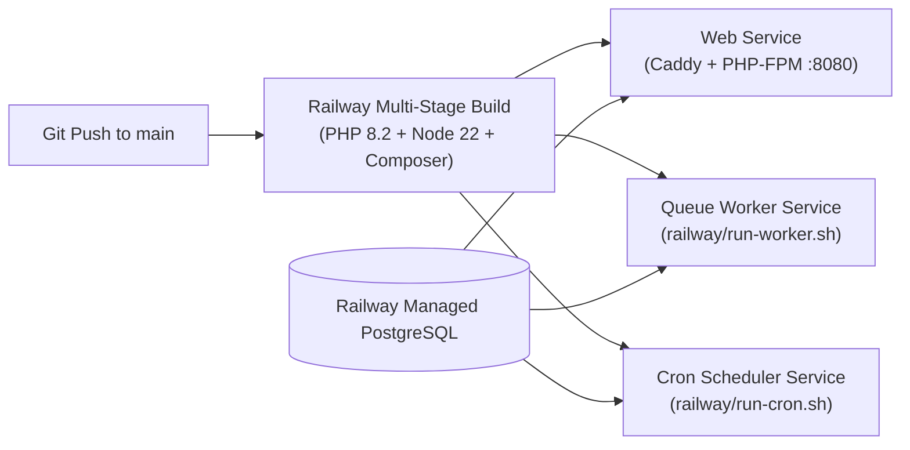

# FleetBe Deployment & Operations Guide

This guide covers local environment setup, Docker containerization, and production deployment on cloud platforms like **Railway**.

---

## 1. Prerequisites

* **PHP:** >= 8.2 with extensions: `bcmath`, `intl`, `opcache`, `pcntl`, `pdo_pgsql`, `pdo_mysql`, `zip`
* **Composer:** >= 2.x
* **Database:** PostgreSQL >= 14 (or MySQL >= 8.0)
* **Container Runtime:** Docker Desktop / Docker Engine >= 24.x and Docker Compose v2

---

## 2. Local Development Setup

### 2.1 Native Setup (Local Machine)

1. **Clone & install dependencies:**
   ```bash
   git clone <repo-url> fleetbe
   cd fleetbe
   composer install
   ```

2. **Configure environment:**
   ```bash
   cp .env.example .env
   php artisan key:generate
   ```
   Edit `.env` to configure your local PostgreSQL database connection:
   ```env
   DB_CONNECTION=pgsql
   DB_HOST=127.0.0.1
   DB_PORT=5432
   DB_DATABASE=fleet
   DB_USERNAME=postgres
   DB_PASSWORD=your_password
   ```

3. **Run database migrations:**
   ```bash
   php artisan migrate
   ```

4. **Start local development servers:**
   ```bash
   php artisan serve --port=8080
   ```
   In a separate terminal, run background queues:
   ```bash
   php artisan queue:listen
   ```

---

### 2.2 Local Setup with Docker Compose

FleetBe includes a pre-configured [`compose.yaml`](file:///Users/saifyusuph/Documents/ES2%20LTD/fleetbe/compose.yaml) that runs the complete Caddy + PHP-FPM container:

1. **Ensure `.env` exists:**
   ```bash
   cp .env.example .env
   ```

2. **Build and start the container:**
   ```bash
   docker compose up --build
   ```

3. **Access points:**
   * **API Base:** `http://localhost:8080/api/v1`
   * **Health Check:** `http://localhost:8080/api/v1/status`
   * **Interactive API Documentation:** `http://localhost:8080/docs`

---

## 3. Production Deployment on Railway

The repository is pre-configured for automated builds on Railway using the root [`Dockerfile`](file:///Users/saifyusuph/Documents/ES2%20LTD/fleetbe/Dockerfile) and startup scripts.



### 3.1 Service 1: Web Application Service
* **Build Source:** Dockerfile (auto-detected by Railway).
* **Start Command:** Default entrypoint [`docker/start-server.sh`](file:///Users/saifyusuph/Documents/ES2%20LTD/fleetbe/docker/start-server.sh).
  * Automatically creates storage links (`storage:link`).
  * Executes migrations automatically on deployment (`php artisan migrate --force`).
  * Boots PHP-FPM on port 9000.
  * Launches Caddy listening on `${PORT}` (provided dynamically by Railway).

### 3.2 Service 2: Queue Worker Service
* Add a second service from the same repo.
* Set **Custom Start Command** in Railway settings:
  ```bash
  railway/run-worker.sh
  ```
* This runs `php artisan queue:work --tries=3 --timeout=90`.

### 3.3 Service 3: Cron Scheduler Service
* Add a third service from the same repo.
* Set **Custom Start Command**:
  ```bash
  railway/run-cron.sh
  ```
* This runs `php artisan schedule:run` every 60 seconds.

---

## 4. Production Environment Variables Checklist

Configure these variables in your Railway project dashboard:

| Variable | Recommended Production Value | Description |
|---|---|---|
| `APP_NAME` | `FleetManagement` | Application display name |
| `APP_ENV` | `production` | Environment mode |
| `APP_KEY` | `base64:...` | 32-character encryption key |
| `APP_DEBUG` | `false` | Disable debug backtraces in production |
| `APP_URL` | `https://your-domain.railway.app` | Canonical public URL |
| `DB_CONNECTION` | `pgsql` | PostgreSQL database connection |
| `DB_URL` | `${{Postgres.DATABASE_URL}}` | Railway Postgres reference variable |
| `LOG_CHANNEL` | `stderr` | Routes logs directly to Railway dashboard |
| `LOG_LEVEL` | `info` | Logging verbosity |
| `SESSION_DRIVER` | `database` | Database-backed sessions |
| `QUEUE_CONNECTION` | `database` | Database-backed job queue |
| `CACHE_STORE` | `database` | Database-backed cache store |
| `MAIL_MAILER` | `smtp` / `postmark` / `resend` | Production transactional mail driver |
| `MAIL_HOST` | `smtp.provider.com` | Mail provider host |
| `MAIL_PORT` | `587` | Mail provider TLS port |
| `MAIL_USERNAME` | `your_user` | Mail provider username |
| `MAIL_PASSWORD` | `your_password` | Mail provider password |
| `MAIL_FROM_ADDRESS`| `no-reply@yourdomain.com` | Sender address |

---

## 5. Operations & Maintenance Commands

### Generating / Updating API Documentation
To regenerate interactive documentation after editing route annotations:
```bash
php artisan scribe:generate
```

### Cache Optimization for Production
Run these commands after deploying updates:
```bash
php artisan config:cache
php artisan route:cache
php artisan view:cache
```

### Clearing Caches
```bash
php artisan config:clear
php artisan cache:clear
php artisan route:clear
```
*(Alternatively, a web fallback endpoint is available at `GET /clear-cache`)*.

